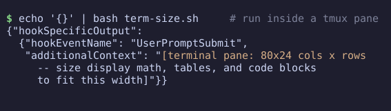
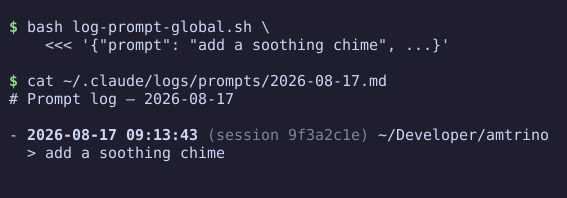
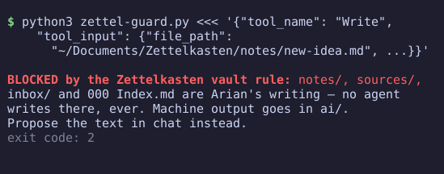

# claude-code-hooks

Three small, independent hooks I run in every Claude Code session on my
machine. Each is a single file; take what you want. Wire them in
`~/.claude/settings.json` under the event named in each section.

## term-size.sh — the model knows your pane width

`UserPromptSubmit`. Injects `[terminal pane: WxH]` into the context of every
prompt, so the model can size figures, tables, and code blocks to actually
fit. Finds the Claude Code process's tty by walking process ancestry, matches
it against tmux panes for the exact pane size, and falls back to `stty`
outside tmux. Silent when the size is unknowable.

This is the difference between diagrams that fit and diagrams that wrap into
soup — the model can't see your terminal without it.

## log-prompt-global.sh — a machine-wide prompt journal

`UserPromptSubmit`. Appends every prompt from every session to
`~/.claude/logs/prompts/YYYY-MM-DD.md` with timestamp, session id, and
working directory. Per-session incognito: type `/incognito` to stop logging
that session (a sentinel file), `/incognito off` to resume; sentinels
garbage-collect after 7 days. Optionally pipes prompts through a local
proofreader binary before logging (skipped when absent). Fails loud on write
errors but never blocks the prompt.

Requires `jq`.

## zettel-guard.py — a hard wall around human-only files

`PreToolUse`. Blocks agent writes (Write/Edit/NotebookEdit, and Bash commands
that would modify) into protected paths of a personal notes vault — in my
case `notes/`, `sources/`, `inbox/`, and the index of a Zettelkasten. Reading
is never blocked. Exit code 2 returns the rule text to the model, which then
proposes text in chat instead of writing the file.

The general pattern: any directory that must stay human-written can be fenced
at the harness level instead of relying on instructions the model might
forget. Edit `VAULT` and `PROTECTED` for your own layout.

## License

MIT
